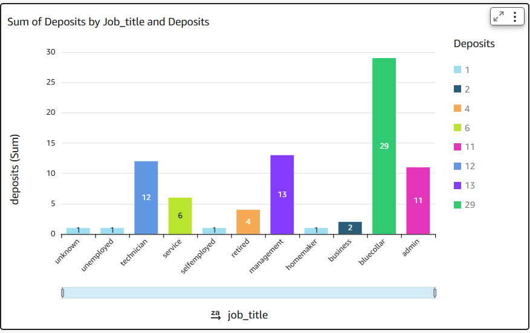
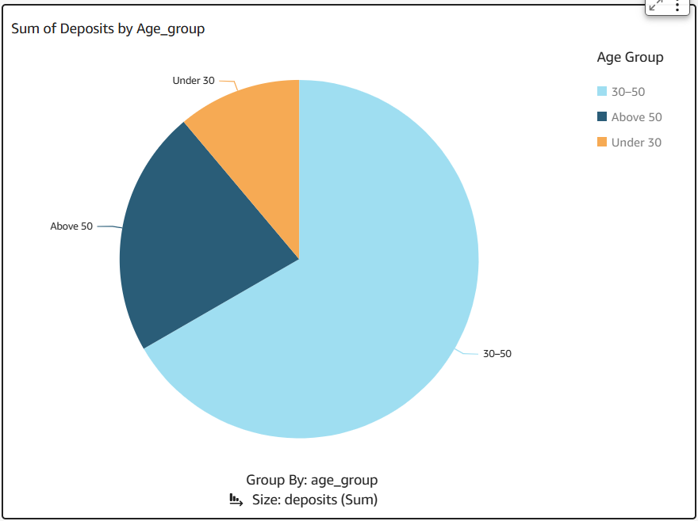
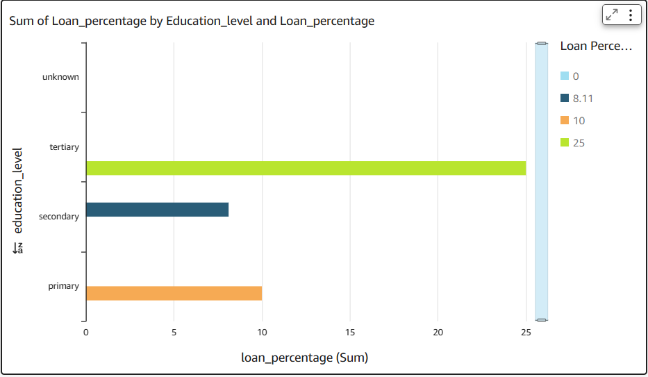

# Real-Time Bank Marketing Data Pipeline on AWS

This project demonstrates a full end-to-end **real-time data engineering pipeline** on AWS using **Medallion Architecture** (Bronze → Silver → Gold). It processes a bank marketing dataset using **Kinesis, Lambda, S3, Glue (PySpark), Athena, and QuickSight**, and generates visual business insights.

---

## 📌 Architecture

---

## 🚀 Project Flow

### 🥉 Bronze Layer: Raw Data Ingestion
- Real-time events simulated and sent through **Amazon Kinesis**
- **AWS Lambda** processes each event and writes it to **S3 (Bronze layer)** in JSON format
- **Glue Crawler** catalogs raw data for processing

### 🥈 Silver Layer: Cleaned & Normalized
- **PySpark Glue Job**:
  - Parses JSON
  - Cleans text (`admin.` → `admin`)
  - Fixes inconsistencies (`self-employed` → `selfemployed`)
  - Writes cleaned data to **S3 (Silver Final layer)**
- Crawled and made queryable with Athena

### 🥇 Gold Layer: Aggregated Business Insights
- Glue Job performs grouped aggregations:
  - Total deposits by job title
  - Monthly deposit conversion rates
  - Deposit behavior by age group
  - Loan distribution by education level
- Writes result as partitioned JSON to **S3 (Gold layer)**

---

## 📊 Business Insights (via QuickSight)

| Insight | Chart | Description |
|--------|-------|-------------|
| Job vs Deposits | Bar Chart | Shows job titles most likely to deposit |
| Age Group | Pie Chart | 30–50 is most responsive to marketing |
| Education vs Loan % | Bar Chart | Tertiary education has highest loan % |

**Visuals:**

  
  

---

## 🛠️ Tools & Tech Stack

- **AWS Kinesis** – real-time data streaming
- **AWS Lambda** – stream processor
- **Amazon S3** – data lake (bronze, silver, gold layers)
- **AWS Glue** – ETL jobs (PySpark) + catalog
- **AWS Athena** – SQL on S3
- **Amazon QuickSight** – data visualization
- **Python** – Lambda + Spark scripts

---

## 📁 Project Structure
bank-marketing-etl-pipeline/
├── README.md
├── architecture-diagram.png
├── images/
│ ├── Deposit_by_Age_Group.png
│ ├── Education_Level_vs_Loan.png
│ └── Job_Title_vs_Deposit.png
├── glue_jobs/
│ ├── bronze_to_silver.py
│ ├── silver_transformation.py
│ └── silver_to_gold.py
├── lambda/
│ └── kinesis_to_s3.py
├── athena/
│ └── gold_insights_queries.sql
├── sample_data/
│ └── bank.csv

---

## 💡 What I Learned

- How to design a real-time data pipeline using cloud-native tools
- Implementing Medallion Architecture in AWS
- Building end-to-end analytics workflow from ingestion to visualization
- Solving business problems using data insights

---

## 👩‍💻 Author

Built by a returning-to-work engineer exploring real-time cloud data systems.  
**Open to data engineering roles | Actively seeking opportunities**

